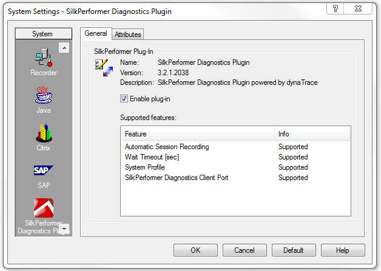
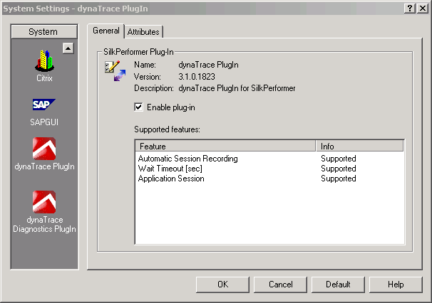
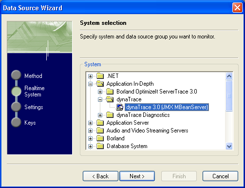
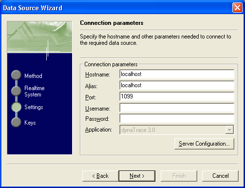
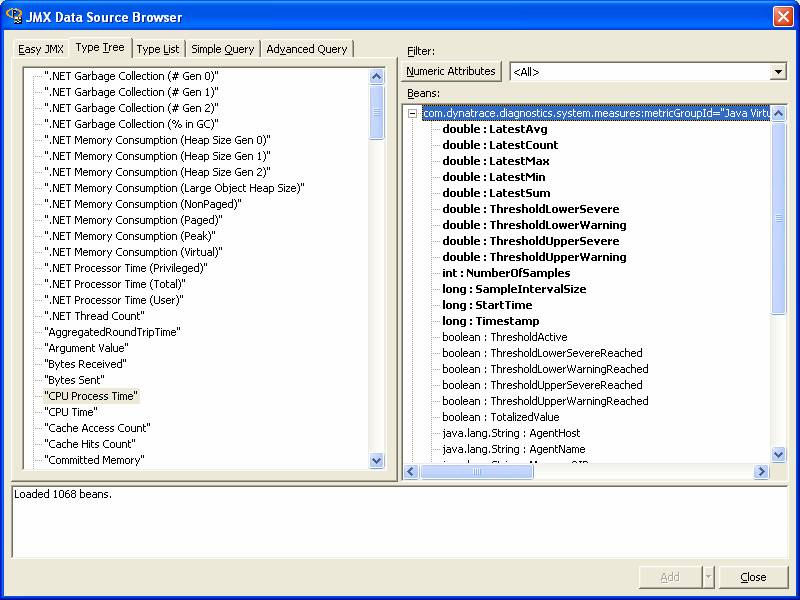

<html xmlns="http://www.w3.org/1999/xhtml">
<head>
    <title>SilkPerformer Plugin</title>
    <meta http-equiv="Content-Type" content="text/html; charset=UTF-8"/>
    <meta http-equiv="X-UA-Compatible" content="IE=EmulateIE8" />
    <meta content="Scroll Wiki Publisher" name="generator"/>
    <link type="text/css" rel="stylesheet" href="css/blueprint/liquid.css" media="screen, projection"/>
    <link type="text/css" rel="stylesheet" href="css/blueprint/print.css" media="print"/>
    <link type="text/css" rel="stylesheet" href="css/content-style.css" media="screen, projection, print"/>
    <link type="text/css" rel="stylesheet" href="css/screen.css" media="screen, projection"/>
    <link type="text/css" rel="stylesheet" href="css/print.css" media="print"/>
</head>
<body>
                <h1>SilkPerformer Plugin</h1>
    

        <h2>Overview</h2>
    

            
        dynaTrace fully integrates with Micro Focus SilkPerformer (formely: Borland SilkPerformer). It extends SilkPerformer's capabilities by pinpointing the root cause of performance, stability, and scalability problems in application code.    

    

See the <a href="http://blog.dynatrace.com/2010/05/04/elevating-web-and-load-testing-with-microfocus-silkperformer-diagnostics-powered-by-dynatrace/">dynaTrace blog</a> for a hands-on introduction incl. a step-by-step guide and screenshots.    

    

    

        <h2>SilkPerformer Plugin 3.2.1 and later</h2>
    

        <table>
<thead class=" "></thead><tfoot class=" "></tfoot><tbody class=" ">    <tr>
            <td rowspan="1" colspan="1">
        

Name    

            </td>
                <td rowspan="1" colspan="1">
        

<strong class=" ">SilkPerformer Plugin 3.2.1+</strong>    

            </td>
        </tr>
    <tr>
            <td rowspan="1" colspan="1">
        

Description    

            </td>
                <td rowspan="1" colspan="1">
        

This is the SilkPerformer Plugin for dynaTrace 3.2.1+    

            </td>
        </tr>
    <tr>
            <td rowspan="1" colspan="1">
        

Compatible with    

            </td>
                <td rowspan="1" colspan="1">
        

dynaTrace 3.2.1 and later    

            </td>
        </tr>
    <tr>
            <td rowspan="1" colspan="1">
        

Tested with    

            </td>
                <td rowspan="1" colspan="1">
        

SilkPerformer 2007, 2008, 2008 R2, 2010, 2010 SP1, 2010 R2, 2011    

            </td>
        </tr>
    <tr>
            <td rowspan="1" colspan="1">
        

Author    

            </td>
                <td rowspan="1" colspan="1">
        

dynaTrace software    

            </td>
        </tr>
    <tr>
            <td rowspan="1" colspan="1">
        

License    

            </td>
                <td rowspan="1" colspan="1">
        

<a href="attachments_5275715_2_dynaTraceES.txt">dynaTrace Experimental Software License</a>    

            </td>
        </tr>
    <tr>
            <td rowspan="1" colspan="1">
        

Support    

            </td>
                <td rowspan="1" colspan="1">
        

<a href="https://community/display/DL/Support+Levels#SupportLevels-Supported">Limited Support</a>    

            </td>
        </tr>
    <tr>
            <td rowspan="1" colspan="1">
        

Download    

            </td>
                <td rowspan="1" colspan="1">
        

<a href="attachments_150700305_1_silkperformer-diagnostics-plugin-5.6.0.5713.zip">SilkPerformer Plugin for dynaTrace 5.6</a> <a href="attachments_121569572_1_silkperformer-diagnostics-plugin-5.5.0.5226.zip">SilkPerformer Plugin for dynaTrace 5.5</a> <a href="attachments_100925539_1_silkperformer-diagnostics-plugin-5.0.0.3772.zip">SilkPerformer Plugin for dynaTrace 5</a> <a href="attachments_89718915_1_silkperformer-diagnostics-plugin-4.2.0.3154.zip">SilkPerformer Plugin for dynaTrace 4.2</a> <a href="attachments_71598121_1_silkperformer-diagnostics-plugin-4.1.0.2914.zip">SilkPerformer Plugin for dynaTrace 4.1</a> <a href="attachments_59703298_1_silkperformer-diagnostics-plugin-4.0.0.2599.zip">SilkPerformer Plugin for dynaTrace 4</a> <a href="attachments_39518959_1_silkperformer-diagnostics-plugin-3.5.0.2248.zip">SilkPerformer Plugin for dynaTrace 3.5</a> <a href="attachments_28770665_1_silkperformer-diagnostics-plugin-3.2.1.2072.zip">SilkPerformer Diagnostics Plugin v3.2.1</a>    

            </td>
        </tr>
</tbody>        </table>
            

    

        <h3>Installation</h3>
    

    

    

    

SilkPerformer 2010 SP1 ships with SilkPerformer Diagnostics Plugin v3.2.1 embedded.    

    

    

Copy the plugin to the <tt class=" ">&lt;SilkPerformer_home&gt;\Working\Plugins</tt> directory and extract it. Start SilkPerformer, choose <tt class=" ">&quot;Settings&quot;</tt> -&gt; <tt class=" ">&quot;System&quot;</tt> and scroll down in the left side bar until the plugin is visible.    

    

            
            

    

Figure: SilkPerformer Plugin installed in SilkPerfomer    

    

    

Some SilkPerformer versions come with a dynaTrace Diagnostics Plugin installed. Please deactivate this plugin to use the SilkPerformer Plugin .    

    

    

    

        <h3>How to use the SilkPerformer Plugin</h3>
    

The SilkPerformer Plugin offers the ability to record a session when a load test (even a try script) is started. This can be done by setting the option <tt class=" ">&quot;Automatic Session Recording&quot;</tt> in the Plugins <tt class=" ">&quot;Attributes&quot;</tt> tab to true.    

    

The <tt class=" ">&quot;Wait Timeout&quot;</tt> Attribute determines the time the SilkPerformer is waiting for the dynaTrace Client to be started. If the dynaTrace Client cannot be reached within this interval the load test will start without dynaTrace session recording.    

    

The <tt class=" ">&quot;System Profile&quot;</tt> Attribute determines the dynaTrace System Profile on which session recording should be started. If omitted, session recording will be started on the first System Profile on the dynaTrace Server with an Agent connected.    

    

The <tt class=" ">&quot;SilkPerformer Diagnostics Client Port&quot;</tt> Attribute determines the dynaTrace client REST interface port.    

    

    

If the dynaTrace Client is connected to multiple dynaTrace servers the first connected server will be used.    

    

    

    

If you change the configured server in dynaTrace Client SilkPerformer has to be restarted.    

    

    

    

    

        <h2>SilkPerformer Plugin 3.2 and earlier</h2>
    

        <table>
<thead class=" "></thead><tfoot class=" "></tfoot><tbody class=" ">    <tr>
            <td rowspan="1" colspan="1">
        

Name    

            </td>
                <td rowspan="1" colspan="1">
        

<strong class=" ">SilkPerformer Plugin 3.2.0 and earlier</strong>    

            </td>
        </tr>
    <tr>
            <td rowspan="1" colspan="1">
        

Description    

            </td>
                <td rowspan="1" colspan="1">
        

This is the SilkPerformer Plugin for dynaTrace 3.2 and earlier.    

            </td>
        </tr>
    <tr>
            <td rowspan="1" colspan="1">
        

Prerequisite    

            </td>
                <td rowspan="1" colspan="1">
        

SilkPerformer 7.2, 7.3, 2006, 2006 R2, 2007, 2008, 2008 R2    

            </td>
        </tr>
    <tr>
            <td rowspan="1" colspan="1">
        

Compatible with    

            </td>
                <td rowspan="1" colspan="1">
        

dynaTrace 3.0 - 3.2    

            </td>
        </tr>
    <tr>
            <td rowspan="1" colspan="1">
        

Tested with    

            </td>
                <td rowspan="1" colspan="1">
        

SilkPerformer 2007, 2008, 2008 R2, 2010, 2010 SP1    

            </td>
        </tr>
    <tr>
            <td rowspan="1" colspan="1">
        

Author    

            </td>
                <td rowspan="1" colspan="1">
        

dynaTrace software    

            </td>
        </tr>
    <tr>
            <td rowspan="1" colspan="1">
        

License    

            </td>
                <td rowspan="1" colspan="1">
        

<a href="attachments_5275715_2_dynaTraceES.txt">dynaTrace Experimental Software License</a>    

            </td>
        </tr>
    <tr>
            <td rowspan="1" colspan="1">
        

Support    

            </td>
                <td rowspan="1" colspan="1">
        

<a href="https://community/display/DL/Support+Levels#SupportLevels-Supported">Supported</a>    

            </td>
        </tr>
    <tr>
            <td rowspan="1" colspan="1">
        

Download    

            </td>
                <td rowspan="1" colspan="1">
        

<a href="attachments_26574877_1_dynatrace-silkperformer-plugin-3.2.0.1974.zip">SilkPerformer Plugin v3.2</a> <a href="attachments_17006678_1_dynatrace-silkperformer-plugin-3.1.0.1823.zip">SilkPerformer Plugin v3.1</a> <a href="attachments_11796504_1_dynatrace-silkperformer-plugin-3.0.1.1598.zip">SilkPerformer Plugin v3.0.1</a>    

            </td>
        </tr>
</tbody>        </table>
            

    

        <h3>Installation</h3>
    

Copy the Plugin to the <tt class=" ">&lt;SilkPerformer_home&gt;\Working\Plugins</tt> directory and extract it. Start SilkPerformer, choose <tt class=" ">&quot;Settings&quot;</tt> -&gt; <tt class=" ">&quot;System&quot;</tt> and scroll down in the left side bar until the dynaTrace Plugin is visible.    

    

            
            

    

Figure: dynaTrace Plugin installed in SilkPerfomer    

    

    

Most SilkPerformer versions come with a dynaTrace Diagnostics Plugin installed. Please deactivate this Plugin to use the dynaTrace Plugin with dynaTrace 3.0 / 3.1.    

    

    

    

        <h3>How to use the SilkPerformer Plugin</h3>
    

The dynaTrace Plugin offers the ability to record a session when a load test (even a try script) is started. This can be done by setting the option <tt class=" ">&quot;Automatic Session Recording&quot;</tt> in the Plugins <tt class=" ">&quot;Attribute&quot;</tt> tab to true.    

    

The <tt class=" ">&quot;Wait Timeout&quot;</tt> Attribute determines the time the SilkPerformer is waiting for the dynaTrace Client to be started. If the dynaTrace Client cannot be reached within this interval the load test will start without dynaTrace session recording.    

    

The <tt class=" ">&quot;Application Session&quot;</tt> Attribute determines the dynaTrace System Profile on which session recording should be started. If omitted, session recording will be started on the first System Profile on the dynaTrace Server with an Agent connected.    

    

    

If the dynaTrace Client is connected to multiple dynaTrace Servers there may be problems with matching the correct System Profile. If the System Profile is available on multiple dynaTrace Servers, it is possible that session recording is started on the wrong Server. If the <tt class=" ">&quot;profile name&quot;</tt> attribute is omitted, session recording may be started on any of the connected dynaTrace Server on the first System Profile with an Agent connected.    

    

    

    

    

        <h2>Patch for SilkPerformer JMX Integration</h2>
    

        <table>
<thead class=" "></thead><tfoot class=" "></tfoot><tbody class=" ">    <tr>
            <td rowspan="1" colspan="1">
        

Name    

            </td>
                <td rowspan="1" colspan="1">
        

<strong class=" ">SilkPerformer JMX Browser Patch</strong>    

            </td>
        </tr>
    <tr>
            <td rowspan="1" colspan="1">
        

Description    

            </td>
                <td rowspan="1" colspan="1">
        

This is the SilkPerformer JMX Browser Patch for dynaTrace 3.0.x and 3.1.    

            </td>
        </tr>
    <tr>
            <td rowspan="1" colspan="1">
        

Prerequisite    

            </td>
                <td rowspan="1" colspan="1">
        

SilkPerformer 2006, 2006 R2, 2007, 2008, 2008 R2, 2009    

            </td>
        </tr>
    <tr>
            <td rowspan="1" colspan="1">
        

Version    

            </td>
                <td rowspan="1" colspan="1">
        

3.0.1    

            </td>
        </tr>
    <tr>
            <td rowspan="1" colspan="1">
        

Compatible with    

            </td>
                <td rowspan="1" colspan="1">
        

dynaTrace 3.1 dynaTrace 3.0.x    

            </td>
        </tr>
    <tr>
            <td rowspan="1" colspan="1">
        

Tested with    

            </td>
                <td rowspan="1" colspan="1">
        

SilkPerformer 2007, 2008, 2008 R2, 2009    

            </td>
        </tr>
    <tr>
            <td rowspan="1" colspan="1">
        

Author    

            </td>
                <td rowspan="1" colspan="1">
        

dynaTrace software    

            </td>
        </tr>
    <tr>
            <td rowspan="1" colspan="1">
        

License    

            </td>
                <td rowspan="1" colspan="1">
        

<a href="attachments_5275715_2_dynaTraceES.txt">dynaTrace Experimental Software License</a>    

            </td>
        </tr>
    <tr>
            <td rowspan="1" colspan="1">
        

Support    

            </td>
                <td rowspan="1" colspan="1">
        

<a href="https://community/display/DL/Support+Levels#SupportLevels-Supported">Supported</a>    

            </td>
        </tr>
    <tr>
            <td rowspan="1" colspan="1">
        

Download    

            </td>
                <td rowspan="1" colspan="1">
        

<a href="attachments_12091396_1_SilkPerformerPatch.zip">SilkPerformer Patch</a>    

            </td>
        </tr>
</tbody>        </table>
            

    

All currently available SilkPerformer versions are missing the JMX integration data for dynaTrace 3.0. To be able to use dynaTrace 3.0 JMX data please follow the steps below.    

    

        <h3>Installation</h3>
    

Copy the zip file to <tt class=" ">&lt;SilkPerformer_home&gt;\Working</tt> and extract it. A dynaTrace 3.0.xml will be extracted to <tt class=" ">&lt;SilkPerformer_home&gt;\Working\Include\jmx-config</tt>. Open the realtime.ini located in <tt class=" ">&lt;SilkPerformer_home&gt;\Working\Include</tt>. Adapt the file as indicated by the excerpt below.    

    

Add the following line to <tt class=" ">&quot;Application In-Depth&quot;</tt>:     
C= JMX:dynaTrace 3.0, Application In-Depth\dynaTrace\dynaTrace 3.0 (JMX MBeanServer),dynaTrace 3.0 (JMX MBeanServer)    
    

    

                

        <pre><code>V= 1.2
S= Application In-Depth\Borland OptimizeIt ServerTrace 3.0\SNMP, SNMP,
 M= SNMP:1.3.6.1.4.1.1648.500.5.4.0,         OptimizeIt ServerTrace 3.0\JVM Heap Size Total,   	eAvgOnlyCounter,  0,  bytes,   	0,  1, 2, 3, 4, 5,
 M= SNMP:1.3.6.1.4.1.1648.500.5.5.0,         OptimizeIt ServerTrace 3.0\JVM Heap Size Used,    	eAvgOnlyCounter,  0,  bytes,   	0,  1, 2, 3, 4, 5,
 M= SNMP:1.3.6.1.4.1.1648.500.8.4.0,         OptimizeIt ServerTrace 3.0\Virtual Memory Total,   eAvgOnlyCounter,  0,  kbytes,   0,  1, 2, 3, 4, 5,
 M= SNMP:1.3.6.1.4.1.1648.500.8.5.0,         OptimizeIt ServerTrace 3.0\Virtual Memory Used,    eAvgOnlyCounter,  0,  kbytes,   0,  1, 2, 3, 4, 5,
 M= SNMP:1.3.6.1.4.1.1648.500.7.4.0,         OptimizeIt ServerTrace 3.0\Physical Memory Total,  eAvgOnlyCounter,  0,  kbytes,   0,  1, 2, 3, 4, 5,
 M= SNMP:1.3.6.1.4.1.1648.500.7.5.0,         OptimizeIt ServerTrace 3.0\Physical Memory Used,   eAvgOnlyCounter,  0,  kbytes,   0,  1, 2, 3, 4, 5,
 M= SNMP:1.3.6.1.4.1.1648.500.6.4.0,         OptimizeIt ServerTrace 3.0\Paging File Total,     	eAvgOnlyCounter,  0,  mbytes,   0,  1, 2, 3, 4, 5,
 M= SNMP:1.3.6.1.4.1.1648.500.6.5.0,         OptimizeIt ServerTrace 3.0\Paging File Used,     	eAvgOnlyCounter,  0,  mbytes,   0,  1, 2, 3, 4, 5,
 C= JMX:dynaTrace Diagnostics 1.6, Application In-Depth\dynaTrace Diagnostics\dynaTrace Diagnostics 1.6 (JMX MBeanServer),dynaTrace Diagnostics 1.6 (JMX MBeanServer)
 C= JMX:dynaTrace Diagnostics 2.0, Application In-Depth\dynaTrace Diagnostics\dynaTrace Diagnostics 2.0 (JMX MBeanServer),dynaTrace Diagnostics 2.0 (JMX MBeanServer)
 C= JMX:dynaTrace 3.0, Application In-Depth\dynaTrace\dynaTrace 3.0 (JMX MBeanServer),dynaTrace 3.0 (JMX MBeanServer)
S= Application Server\BEA WebLogic preconfigured\SNMP, ESNMP:BEA-WEBLOGIC-MIB,</code></pre>
        

    

    

The installation is finished and the JMX data of dynaTrace 3.0 is now available in SilkPerformer.    

    

    

        <h3>How can I add dynaTrace 3.0 JMX data?</h3>
    

Open <tt class=" ">&quot;Silk Performance Explorer&quot;</tt> and choose <tt class=" ">&quot;Monitor&quot;</tt> -&gt; <tt class=" ">&quot;Add Data Source&quot;</tt>. In the <tt class=" ">&quot;Data Source Wizard&quot;</tt> choose <tt class=" ">&quot;Select from predefined Data Source&quot;</tt> and click <tt class=" ">&quot;Next&quot;</tt>. Open <tt class=" ">&quot;Application in-Depth&quot;</tt> -&gt; <tt class=" ">&quot;dynaTrace&quot;</tt> -&gt; <tt class=" ">&quot;dynaTrace 3.0&quot;</tt> and click <tt class=" ">&quot;Next&quot;</tt>.    

    

            
            

    

Fill in the correct data in the connection parameters dialog:    

    

            
            

    

Choose the JMX values you want to monitor:    

    

            
            

    

    

            

        

        

        

    

</body>
</html>
